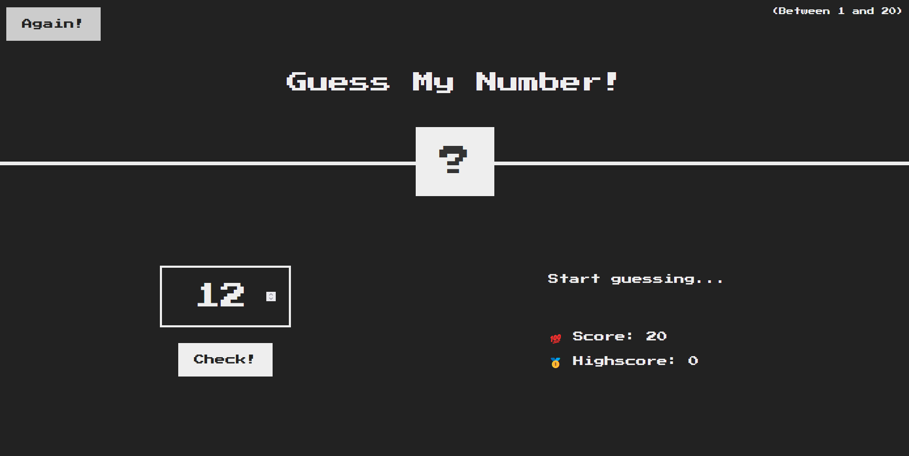

# Guess the Number Game

## Description
This is a simple JavaScript-based game where the user tries to guess a randomly generated number between 1 and 20. The game provides feedback on whether the guess is too high, too low, or correct. Players aim to achieve the highest possible score by guessing the number in as few attempts as possible.

## Features
- Randomly generates a number between 1 and 20.
- Displays feedback messages for user guesses.
- Keeps track of the player's score.
- Stores the highest score.
- Allows resetting the game for replay.
- Styled with modern CSS and a retro gaming font.

## Technologies Used
- HTML
- CSS
- JavaScript

## How to Play
1. Open the game in a browser.
2. Enter a number between 1 and 20 in the input field.
3. Click the "Check" button to submit your guess.
4. Receive feedback:
   - "Too high" if the guess is greater than the number.
   - "Too low" if the guess is smaller than the number.
   - "Correct answer" if the guess is correct.
5. The game updates the score and high score accordingly.
6. Click "Again" to restart the game with a new number.



## File Structure
- `index.html` - Contains the game structure and elements.
- `style.css` - Styles the game using CSS.
- `script.js` - Contains the game logic.

## Code Explanation
### JavaScript Logic
- Generates a random number using:
  ```js
  let randomNumber = Math.trunc(Math.random() * 20) + 1;
  ```
- Stores and updates the score and high score.
- Listens for the "Check" button click event to process user input.
- Provides appropriate feedback messages.
- Changes background color and number width upon a correct guess.
- Resets the game when the "Again" button is clicked.

### CSS Styling
- Uses the `Press Start 2P` font for a retro look.
- Applies flexbox for layout organization.
- Changes background color and adjusts element sizes dynamically.

## Future Enhancements
- Add difficulty levels.
- Implement sound effects for interactions.
- Improve responsiveness for mobile devices.


